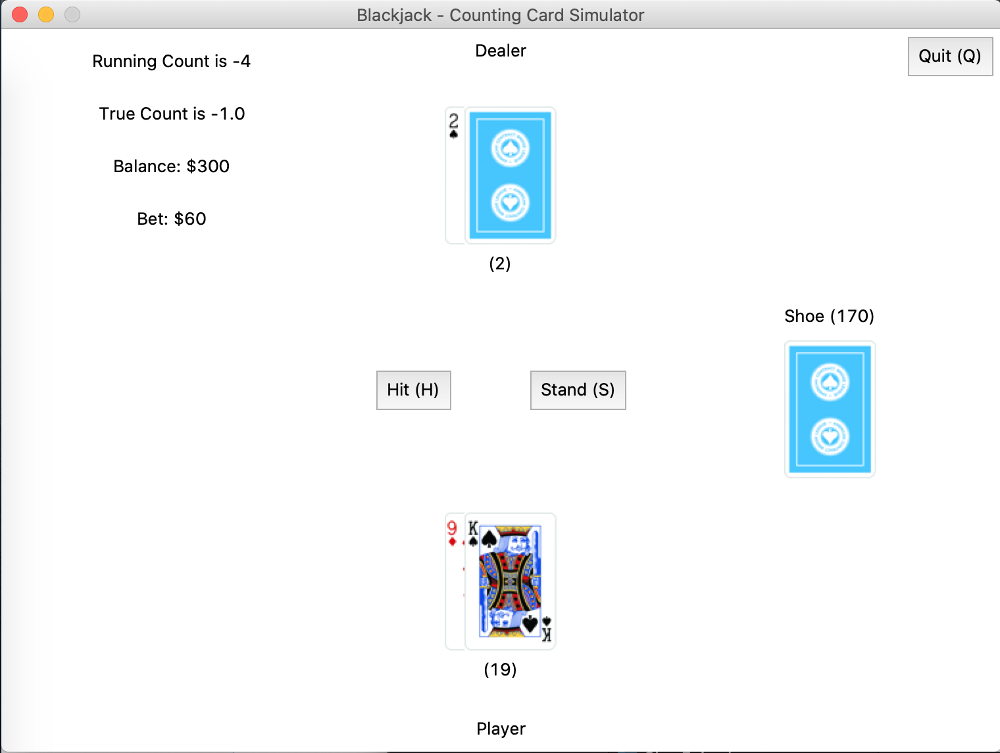

# Blackjack - Counting Cards

Ever watched the movie [21](https://en.wikipedia.org/wiki/21_(2008_film))? In short, MIT students profit from playing Blackjack in casinos via card counting. You can use this Blackjack game to simulate the experience, albeit it will be far less exciting and you are earning fake money.

The game keeps track of true count and running count using the Hi-Lo method, allowing the player to place bets accordingly.



### Demo

[Link to Demo](https://repl.it/@kristelfung/blackjack-count-cards#README.md) hosted on repl.it. Click Run to start the demo, but for a better experience you should run the app natively.

### Prerequisites

Need [Python](https://www.python.org/downloads/) and [Pillow](https://pillow.readthedocs.io/en/stable/installation.html).

### Getting Started

Clone the repository, navigate to the directory and run
```
python3 blackjack.py
```

### Rules
[Bicycle Cards](https://bicyclecards.com/how-to-play/blackjack/)

### Calculating Count

Using the Hi-Lo method:
- [2, 3, 4, 5, 6] = +1
- [7, 8, 9] = 0
- [10, J, Q, K, A] = -1

Assigning these values to all cards seen gives us the Running Count.

True Count is Running Count / Decks Remaining. For simplicity, we will always divide by 4, the total number of decks in the shoe.

When the count is high, player advantage increases.

When the count is low, dealer advantage increases.

### Basic Strategy

- When dealer's card is 7, 8, 9, 10-card, or ace, player should draw until 17 or more is reached
- When dealer's card is 4, 5, 6, player should draw until 12 or more is reached
- When dealer's card is 2, 3, player should draw until 13 or more is reached
- If player has an ace (soft hand), player should draw until 18 or more is reached

Summarized from [Bicycle Cards](https://bicyclecards.com/how-to-play/blackjack/).

### Payout
- Player bust or lose: lose bet amount
- Player win: receive bet amount
- Player has natural and dealer does not have natural: receive 1.5x of bet amount
- Dealer has natural and player does not: lose bet amount
- Standoff (tie): take back bet / no change

### Placing Bets

- Place a bet of Betting Unit * (True Count - 1)

For instance, if the betting unit is $25 and the true count is 2, we should place a bet of $25 * (2 - 1) = $25. 

Summarized from [Card Counting | WIRED](https://www.youtube.com/watch?v=G_So72lFNIU).

### Why Counting Works

With a higher count:

1. More blackjacks for everyone, but there is a 1.5x payout for the player
2. Insurance becomes profitable with a positive count (likely for dealer to blackjack too)
3. More likely for dealer to bust on a high count
4. Double Down is profitable
5. Split 8, 9, 10-cards, or aces is profitable
